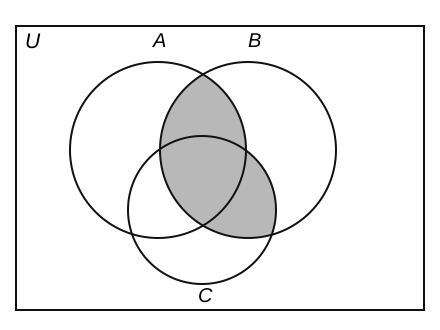

# B02 student-only packet

## ALITE-PALMA25-H1-2MID-B02-Q08-BP01

전체집합 $U=\{1,2,\ldots,100\}$의 부분집합
$A=\{x\in U\mid 6\mid x\}$, $B=\{x\in U\mid 9\mid x\}$에 대하여
$A$와 $B$ 중 정확히 하나에 속하는 원소의 개수는?

① $22$  
② $27$  
③ $5$  
④ $17$  
⑤ $11$

## ALITE-PALMA25-H1-2MID-B02-Q10-BP01

다음 벤다이어그램의 색칠한 부분을 나타내는 집합은? (단, $U$는 전체집합이다.)

① $(A\cup C)\cap B^C$  
② $B\cap(A\cup C)$  
③ $(A\cap B)\cup C$  
④ $(A\cup B)\cap C$  
⑤ $A\cap B\cap C$

## ALITE-PALMA25-H1-2MID-B02-Q20-BP01

한 학년 학생 30명을 대상으로 방과 후 프로그램 A와 B의 신청 여부를 조사했다.
A를 신청한 학생은 18명, B를 신청한 학생은 16명이다. 두 프로그램 중 정확히
하나만 신청한 학생 수의 최댓값과 최솟값을 각각 구하고, 각 끝값이 가능한
이유를 서술하시오.

최댓값 __명, 최솟값 __명. 풀이 과정과 두 끝값이 실제로 가능함을 함께 서술한다.
