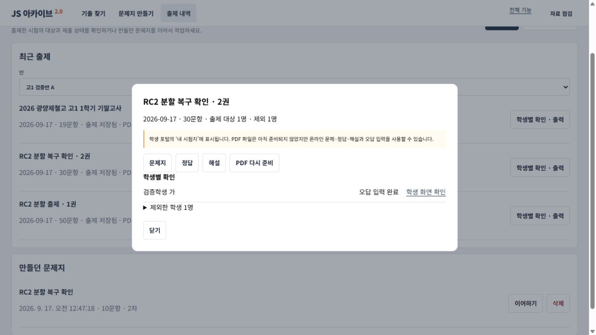
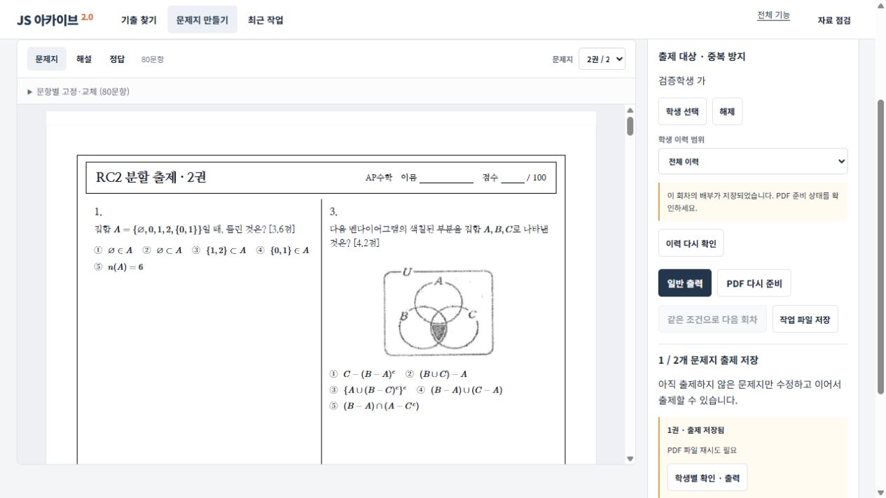
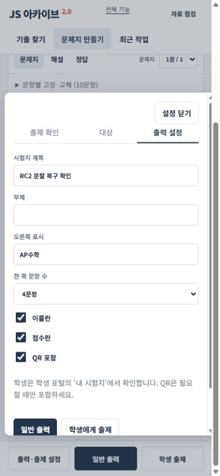

# Archive 2.0 RC2 — 실제 사용 검토와 검증

작업일: 2026-09-16~17. 시작 HEAD: `6e69a8a034db6e781f948441f07768a4c5496fe6`.
브랜치: `codex/archive2-longterm-20260916`. 최종 구현 commit은 이 문서를 포함한 commit이다.

## 발견과 개선

원본 출제의 이력 누락(bridge 0건)과 재시도 때 신규 학생 추가를 actual workerd/D1에서
재현했다. split의 첫 receipt가 전체를 seal하는 코드와 사용자 경험도 확인했다.

추가로 다음을 고쳤다.

- 원본 Worker의 JS 평가 fallback에 의존하면 문항 등록이 실패하고, QR OFF에서도
  engine의 blueprint 등록을 기대할 수 없다. 원본도 출제 저장 transaction에서 끝낸다.
- PDF 실패와 학생 접근을 별도로 표시한다. 신 아카이브에서 대상/제외/오답 입력 상태,
  문제/정답/해설, PDF 재시도를 바로 확인한다.
- 일반 출력만으로 전체 작업을 잠그던 동작을 제거했다.
- split의 전체 문항 hash 때문에 다른 권의 key까지 바뀌던 문제를 고쳤다.
- 복구 시 전체 선택 UID를 이력에서 지우던 범위를 실제 저장된 권의 UID로 제한했다.
- 문항 수 입력값과 실제 생성 계획이 다를 수 있던 부분을 input 단계에서 동기화했다.
- 여러 권의 문항 관리 목록을 현재 권으로 좁히고 실제 문항 번호와 맞췄다.
- 교체 후보가 선택한 단원 밖으로 나가지 않도록 전체 canonical 경로 조건을 유지한다.
- 모바일에서는 문제지 위에서 출력·출제 설정을 열 수 있게 했다.

## 사용자 용어

| 이전 | 현재 |
|---|---|
| 맞춤 구성 | 문제지 만들기 |
| 문제지 구성 | 출제 범위 · 문항 수 |
| 구성 계획 | 문항 수 설정 |
| 구성 행 | 출제 조건 |
| 새로 구성 | 다시 만들기 |
| 고정 외 재구성 | 고정 외 다시 만들기 |
| 헤더 | 출력 설정 |
| JSON 백업 | 작업 파일 저장 |
| 데이터 상태 | 자료 점검 — 보조 진입점 |
| 최근 작업 | 출제 내역 — 최근 출제와 만들던 문제지 |
| 부분 저장 이후 PDF 다시 준비 | 남은 문제지 출제 |

## P1 검증

| 항목 | 재현 및 수정 후 결과 |
|---|---|
| P1-01 | RC1 native bridge 0건 재현. RC2 원본 전체 row와 등록 UID 즉시 history 연결. 원본 마지막 19번 OMR의 blueprint UID와 frozen UID 일치. |
| P1-02 | RC1 새 학생 C가 재시도 recipient에 추가됨 재현. RC2 C가 추가되지 않음, A 대상/B 제외 유지, 같은 UUID retry. exclusion 삽입 실패를 주입했을 때 assignment까지 rollback. |
| P1-03 | 80문항 50+30에서 첫 50 저장 후 두 번째에 의도적 409. 1/2 상태 표시, reload/restore, 두 번째 한 문항과 제목 수정, 재시도하여 2/2. 첫 권의 UUID/hash/ordered UID 모두 동일, 최종 UID unique 80. |

실제 split 검증의 첫 assignment는 `9ad11cf9-c217-4635-a86c-c4de13897cef`, hash는
`c8875ae7f27df1d139005a8dbdcaecd3fd52adf92785fb794b74b72f2828500c`였다.
복구한 두 번째 assignment는 `48369026-3434-493f-a3fc-9fc96b4eafbc`다.
두 번째의 30번 오답 UID는 `qid_v1_413ba6eb5e12973f1fd350ad69618498591cddd6e90e9fb13793eca4dc7de74c`로
저장 snapshot의 마지막 UID와 일치했다. 모두 합성 학생을 사용하는 로컬 데이터다.

## 실제 브라우저 사용 단계

1. **기출 찾기 — 개선됨.** 원본이 기본 행동이며 제목을 구조화 데이터에서 만든다.
2. **원본 반/학생 선택·출력 설정 — PASS.** 기존 패널, 일부 학생 제외, 공통 제목/문항 수/이름/점수/QR 설정을 사용했다.
3. **원본 출제 결과 — PASS.** 19문항 원본을 저장하고 학생 포털에 동일 제목으로 표시했다. 제외 학생에게는 보이지 않았다.
4. **원본 문제/정답/해설/OMR — PASS.** 세 모드에 canonical source refs 19개, 마지막 19번 오답과 frozen UID 일치.
5. **문제지 제작 — PASS.** 다중 단원, 난이도 2·3, 80문항 생성. 첫 권 고정 43 유지/신규 7, 다른 권 30 불변. 1문항 교체와 exact undo.
6. **split 복구 — PASS.** 실패한 권만 수정·저장하고 첫 권 불변을 실제 API 결과로 비교했다.
7. **제작 문제지 학생 포털 — PASS.** 50/30문항 각각 표시, 복구한 30문항의 문제/정답/해설 source refs 일치, 30번 오답 UID 연결.
8. **다음 회차 — PASS.** 원본 19+제작 80=99문항 이력 확인. 새 10문항과 이전 회차 80문항 교집합 0.
9. **QR OFF/ON — PASS.** 동일한 10문항에서 QR canvas 0/1, 문항 순서 동일. ON은 학생 포털을 가리킨다. 출력 후 편집 가능.
10. **최근 출제 — PASS.** 기존 assignment API로 최근 시험, 대상/제외, 오답 입력 완료 상태를 확인했다.
11. **모바일 — PASS.** 390px에서 clientWidth=scrollWidth=375. 문항 확인, 설정 sheet, 출력 버튼 조작을 수행했다.

화면 근거는 `rc2-evidence/`에 보관한다. 이번 audit 스킬은 실제 화면을 먼저 보고,
각 단계의 문제를 증거와 연결하는 데 사용했다. 전체 WCAG 적합성 감사는 아니다.

교사용 학생 화면 미리보기도 직접 열어 동일 원본 시험 표시와 OMR 작성 버튼 비노출을
확인했다. 관련 Node/기존 계약 검증 22/22 PASS, actual workerd/D1 시나리오 PASS,
catalog 재생성 일치, Worker deploy dry-run, diff whitespace 검증을 완료했다.

### 화면 근거

출제 결과에서 대상과 제외 학생, 온라인 접근과 PDF 상태를 분리한다.

부분 성공 재현 화면이다. 이후 주 행동 문구를 `남은 문제지 출제`로 정리했다.

390px에서 문제지를 떠나지 않고 출력·출제 설정을 조작한다.

## 검증 범위와 운영 전 확인

실제 Worker route와 로컬 D1/R2를 사용하는 fixture다. 학생 포털의 주변 과제/홈 요약은
합성 응답이며, 시험 목록·recipient/exclusion·OMR·wrong_answers는 실제 route를 사용한다.
Browser Rendering binding이 없으므로 PDF 생성 실패는 예상 결과다. 저장 성공·같은 UUID
retry·대상 보존·출력 URL/화면을 검증했으며 production PDF 성공으로 해석하지 않는다.

운영에서는 Browser Rendering → R2 PDF, 새 catalog/UI/Worker의 함께 배포,
RC1 bridge migration과 승인된 legacy reconciliation을 확인해야 한다. 전체 legacy
전수회귀는 별도 감사 범위이며, 이번 변경에 직접 걸리는 기존 출력·학생 포털 계약은 실행했다.

원본 source JS, identity map, 승인 metadata sidecar 수정 없음. main merge, 운영 배포,
remote migration 또는 remote 학생 데이터 쓰기 없음.
