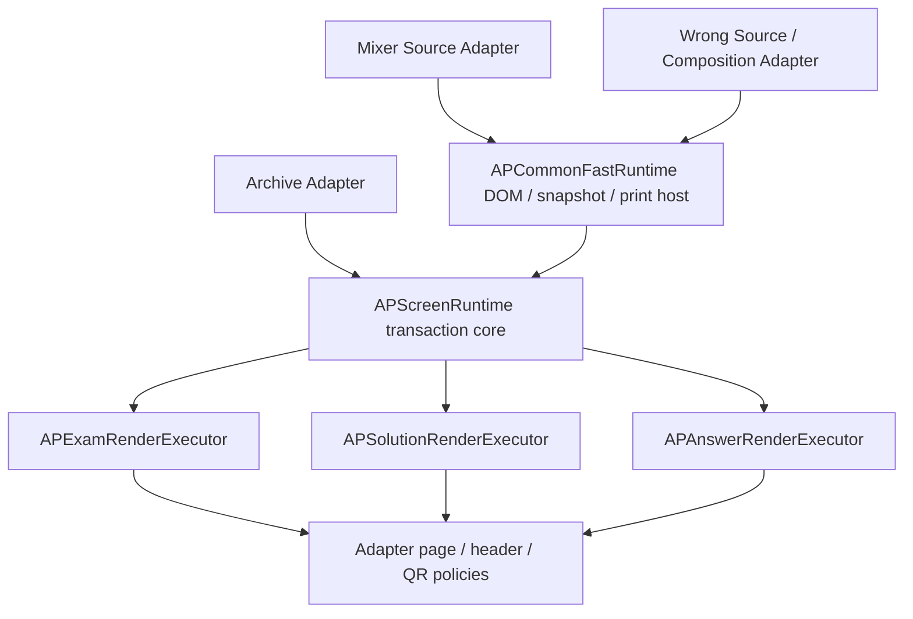

# AP Archive 3엔진 Fast Runtime 통합 — 자체 검증 인계

구현 및 자체 테스트를 마쳤으며, `codex/archive-three-engine-fast-runtime` 브랜치에서 별도 검수를 받을 수 있는 상태다. main에 merge하거나 외부에 배포하지 않았다. Weakness 모듈은 작업 범위에 포함하지 않았다.

기준은 `codex/archive-fast-engine-v2-phase1a`의 `6d93da5bea3ecfdcb7d164b78ad72659eeec4ab4`다. 기준 worktree의 추적 파일이 변경되지 않았음을 확인하고, 별도 HTTP 서버에서 기준과 구현을 비교했다.

## 1. 실제 공통 구조



새 Fast Mixer Engine이나 Fast Wrong Engine을 별도 복제하지 않았다. 기존 `APScreenRuntime`을 세 엔진의 동일 transaction authority로 사용한다. Mixer와 Wrong에는 공통 DOM host를 연결했고, 기존 helper를 빌드별 closure에 묶어 현재 UI 상태와 빌드 상태를 분리했다. 기본 closure만 UI 이벤트·부팅을 설치한다.

| 영역 | 실제 사용 범위 | 구현 |
|---|---|---|
| request generation, cancellation, latest-wins, commit/rollback, session retirement | 3엔진 | 기존 `archive/screen-runtime.js`를 그대로 공유 |
| immutable capture, semantic digest, snapshot key | 3엔진 | `archive/render-state-normalizer.js` 공유; Archive의 strict candidate schema는 기존대로 유지 |
| detached build DOM, source-read deadline, snapshot cache, prewarm, print binding | Mixer / Wrong | 새 `archive/common-fast-runtime.js` |
| exam 실행 | 3엔진 | `APExamRenderExecutor.render` 및 policy를 받는 `renderComposed` |
| raw/tight staging 측정 | 3엔진 | 동일 `measureProfiles`; batch 측정과 실패 시 임시 class 복구 |
| solution 실행 / continuation | 3엔진 | `APSolutionRenderExecutor.render` 및 policy를 받는 `renderComposed` |
| answer grid, 4문제 grouping, 빈 cell, 페이지 분할 | 3엔진 | 동일 `APAnswerRenderExecutor.render`; Wrong의 표시 번호는 callback으로 유지 |
| MathJax orchestration / metrics | 3엔진 | `APRenderLoop`; Mixer/Wrong도 transaction별 metrics와 cancellation 경계를 사용 |
| readiness 상태 순서와 이미지 실패 차단 | 3엔진 | `APPrintRuntime`; 이미지 URL 해석과 준비 helper는 source adapter에 유지 |
| print preflight | Mixer / Wrong | 같은 host가 활성 root/session/key, HTML, canvas, 폰트, MathJax, 이미지 및 geometry 검사 |
| Archive snapshot hard gates / layout materializer | Archive | 기존 검증된 adapter와 `snapshot-contract.js`, `layout-materializer.js` 유지 |

레이아웃 정책까지 하나로 강제하지 않았다. Archive는 기존 measured production materializer를 사용한다. Mixer는 공통 executor의 observed placement 경로를 사용하며, Wrong은 공통 executor의 composed placement 경로에 page/box 정책을 주입한다. 따라서 Archive의 materializer와 23개 print gate가 세 엔진에 모두 이식되었다고 주장하지 않는다.

## 2. 각 엔진에 보존한 고유 계층

**Archive:** JS source loading, metadata/identity, 일반 시험지 options, QR/assignment, source fetch isolation, 기존 snapshot hard gates와 인쇄 경로. `archive/engine.html`과 기존 Archive adapter/core 파일은 기준 대비 변경하지 않았다.

**Mixer:** selection/filter/cart, blueprint, 단원별 기출의 실제 저장 계약, assessment pack loading, mixed key/metadata/order, QPP 4/6/8, 헤더와 QR 정책, 업무 API 등록. 이 로직을 일반 renderer에 옮기지 않았다. 실제 단원별 `storeMixedPayload`와 Clinic의 `saveClinicMixedPayload`·`buildMixedEngineClinicUrl`을 실행해 만든 데이터로 consumer 브라우저 경로를 검증했다.

**Wrong Clinic:** 학생·반·학년·유형 집계, source bank 복원, packet/set/compact public key, recipient, 학생별 page break와 duplex blank, recipient header, Clinic QR, review packet, 부모 preview message, wrong-clinic API loading. 공통 executor에는 문항 box/page 제작과 마지막 페이지 장식 등의 callback을 전달한다.

## 3. Legacy / fallback

- Mixer와 Wrong의 기존 inline 렌더러·composition 코드는 삭제하지 않았다.
- `runtime=legacy`: Mixer/Wrong 전체 legacy 경로. 공통 필수 모듈이 없을 때도 이 경로를 사용한다.
- `executor=legacy`: 공통 transaction host 안에서 기존 inline renderer를 비교할 수 있는 경로.
- `snapshotCache=0`: 새 host의 캐시 비활성화.
- `prewarm=1`: Mixer/Wrong의 자동 prewarm 활성화. 기본은 opt-in이며 수동 `runtime.prewarm(mode)`도 지원한다.
- Archive의 `screenRuntime=legacy`, 개별 authority option 등은 기존대로 남아 있다.
- Mixer의 PDF viewer business mode도 기존 별도 경로를 유지한다.

## 4. 실제 검증 결과

| 검증 | 결과 | 근거 |
|---|---:|---|
| 기본 output parity | 19/19 PASS | `parity.json` |
| 확장 source/composition parity | 34/34 PASS | `extended-parity.json` |
| transaction / cache / 실패 / print lifecycle | 15/15 PASS | `lifecycle.json` |
| 부모 preview, packet/set/compact QR, explicit/missing-module fallback | 8/8 PASS | `protocols.json` |
| Archive 최종 회귀 | 19/19 PASS; page error 0 | `archive-final.json` |
| Chrome PDF 페이지 수와 화면 페이지 수 | 53/53 일치 | `pdf-page-audit.json` |
| 대표 6개 기준/신규 PDF의 실제 페이지 수·페이지별 추출 텍스트 | 6/6 일치 | `pdf-content-parity.json` |
| 공개 QR route PDF | packet 6쪽, set 6쪽, compact 4쪽 생성 | `public-*.pdf` |
| 정적·단위 테스트 | 74개 중 72 PASS, baseline에서도 실패하는 2개 | `static-tests.tap`, `baseline-inherited-tests.tap` |

출력 비교는 실제 Chrome 1440px/390px에서 수행했다. 문항 수·순서·본문·선택지·해설·정답·문항별 위치/크기·SVG/이미지 준비·QR 수·페이지 수를 비교했다. 원본 식별자가 다른 같은 번호 문항, fullwidth, subjective 2up/4up, 긴 해설 continuation, recipient 경계와 duplex blank를 포함했다. 모든 53쌍의 전체 화면 PNG 크기도 일치한다.

기본 Mixer, 단원별 기출, Assessment pack, Clinic-Mixed, Wrong student/class/grade/type 및 review 경로를 포함한다. 전체 정답 복원/source bank fixtures와 대표 실제 bank를 사용했다. 장바구니/필터 UI 전체를 새로 자동화했다는 의미는 아니다.

실제로 Chrome PDF를 생성했고 대표 PDF는 기준과 페이지별 텍스트까지 비교했다. 인쇄 버튼과 preflight는 dry-run으로 검증했다. 물리 프린터 출력이나 native PCL/GDI 전송은 실행하지 않았다. API는 브라우저 route interception으로 응답을 통제했으며 실제 운영 데이터에 등록하지 않았다.

### 성능 참고 측정

동일한 로컬 Chrome fixture에서 3개 모드가 준비된 이후의 전환 중앙값:

| 엔진 | 기준 | 공통 Fast 경로 |
|---|---:|---:|
| Mixer | 362.6ms | 6.5ms |
| Wrong | 127.9ms | 17.2ms |

`performance.json`에 cold/warm sample과 cache HIT 여부를 저장했다. 특정 환경·fixture의 참고값이며 모든 시험지/장치에 대한 성능 보장은 아니다.

## 5. 구현 중 발견·수정한 문제

1. 직접 전역 상태와 현재 DOM을 바꾸던 렌더 경로를 빌드별 상태/DOM으로 분리했다. 지연 빌드 중에도 이전 root와 source를 유지하고 최신 요청만 commit한다.
2. 캐시 key에 파생 layout ledger가 섞이지 않도록 source/business input을 구분했다. 문항 순서·metadata·recipient options는 key에서 보존한다.
3. Wrong의 source fetch와 MathJax 실패를 새 경로에서는 전파하여 미완성 결과가 commit/print되지 않게 했다.
4. vector 인쇄에서 preflight 실패 후 뒤의 인쇄 코드로 진행할 수 있는 경로를 막고, 반복 인쇄마다 readiness tracker를 새로 바인딩했다.
5. QR·QPP·헤더·shuffle을 transaction intent로 연결하고, QR 컨트롤도 candidate URL에 맞춰 commit한다.
6. Wrong preview의 새 payload를 렌더 전에 현재 state에 먼저 넣던 경로를 수정했다. 대기/빌드 중에는 이전 recipient packet을 유지한다.
7. QR mode lock을 UI 함수뿐 아니라 adapter intent 처리에서도 강제했다. 내부 request와 prewarm도 잠금 정책을 우회하지 않는다.
8. 공통 raw/tight 측정이 취소/실패하면 임시 fit class를 반드시 제거한다.

테스트 자체에서도 수정이 있었다. 번들 Playwright의 async `waitForFunction` predicate가 Promise 완료 전에 truthy로 평가되어 Assessment 초기 sentinel을 읽는 문제가 있었으므로, 실제 readiness outcome을 명시적으로 polling하도록 고쳤다. 초기 잘못된 대기 결과는 `initial-harness-parity.json`에 별도 보존했고 최종 판정에는 쓰지 않는다. 기존 Wrong 순수 함수 테스트는 새 closure에서 helper를 읽도록 harness만 조정했다.

## 6. Known issue / 남은 공통화

- 과거 `print-render-authority-drift-ledger`는 Archive의 변경된 호출 시그니처를 반영하지 못하고, Phase 0 SHA lock은 `.agent/DOMAIN_LOCK_POLICY.md`부터 기준과 다르다. 두 실패를 원본 기준 worktree에서도 재현했다. 과거 lock이나 관련 없는 정책 파일은 수정하지 않았다.
- 기존 모바일 screen-fit의 가로 overflow와 좁은 툴바 배치는 그대로다. 예를 들어 390px Mixer solution의 전체 캡처는 기준/신규 모두 584px 폭이다. 이번 통합으로 생긴 차이는 아니며 모바일 CSS 개선은 하지 않았다.
- Archive 전용 snapshot 계약과 materializer는 유지했다. 세 adapter의 candidate/schema 및 layout 전략까지 완전히 하나로 만든 상태는 아니다.
- Legacy와 shared executor의 일부 기계적 중복은 비교/rollback을 위해 남아 있다. 별도 전수 검수 이후 삭제 여부를 판단해야 한다.
- 실제 서버 인증/업무 API end-to-end 및 물리/native 프린터 전송은 이번 검증에 포함되지 않는다.
- 이번 테스트 matrix에서는 미해결 신규 출력 regression을 발견하지 못했다. 모든 가능한 bank와 사용자 데이터의 전수 검수 완료를 뜻하지 않는다.

## 7. 변경 파일과 커밋

프로덕션 변경 파일:

- `archive/common-fast-runtime.js`
- `archive/mixed_engine.html`
- `apmath/wrong_print_engine.html`
- `archive/exam-render-executor.js`
- `archive/solution-render-executor.js`
- `archive/answer-render-executor.js`

검증 코드:

- `tests/three-engine-fast-parity.cjs`
- `tests/three-engine-fast-lifecycle.cjs`
- `tests/three-engine-fast-protocols.cjs`
- `tests/three-engine-fast-performance.cjs`
- `tests/common-render-measurement.test.js`
- `tests/apmath-wrong-print-qr-solution-regression.test.js`
- `tools/three-engine-fast-runtime/audit.py`

모든 보고서·PNG·PDF를 포함한 전체 목록은 `changed-files.json`, 파일별 byte 수/SHA-256은 `artifact-manifest.json`에 있다. 이번 작업과 무관한 다른 untracked 파일은 커밋에 넣지 않았다.

구현 커밋:

- `110d7ccf6` — integrate Mixer and Clinic with shared fast render runtime
- `d448dddc8` — enforce QR and source policies for every render intent

이후 검증 코드/증거/인계 보고서를 별도 커밋한다. 최종 커밋 목록과 branch HEAD는 응답에서 전달하며 로컬에서 다음 명령으로도 확인할 수 있다.

```powershell
git log --oneline 6d93da5bea3ecfdcb7d164b78ad72659eeec4ab4..HEAD
git rev-parse HEAD
```

## 8. 재실행

구현 checkout은 `127.0.0.1:8766`, 변경 없는 기준 checkout은 `127.0.0.1:8767`로 제공한다. `AP_PLAYWRIGHT_MODULE`은 설치된 Playwright package 경로로 지정한다. 테스트 중 API 쓰기는 intercept된다.

```powershell
node tests/three-engine-fast-parity.cjs
$env:AP_EXTENDED_ONLY = '1'
$env:AP_PARITY_REPORT = 'extended-parity.json'
node tests/three-engine-fast-parity.cjs
Remove-Item Env:AP_EXTENDED_ONLY
Remove-Item Env:AP_PARITY_REPORT
node tests/three-engine-fast-lifecycle.cjs
node tests/three-engine-fast-protocols.cjs
node tests/three-engine-fast-performance.cjs
python tools/three-engine-fast-runtime/audit.py
```

`AP_CASE_FILTER`로 특정 case를 선택할 수 있고 `AP_PRINT_BASELINE=1`이면 기준 PDF도 생성한다. 최종 PDF content audit에는 대표 6개 case의 `print-parity.json`과 baseline PDF가 필요하다. 저장된 보고서에는 해당 실행 결과를 모두 포함했다.
